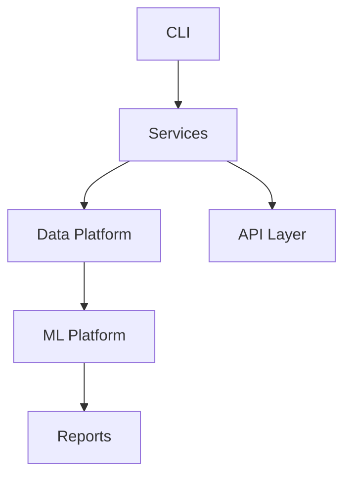

# Architecture Guide

## Overview

AgriMind AI is a modular data and machine-learning platform organized around a Python application package in [core/app](../)..). The architecture separates configuration, data engineering, ML capabilities, services, and CLI entrypoints so each subsystem can evolve independently while still sharing common infrastructure.

## High-level structure

- [core/app/cli](../../app/cli) exposes the user-facing command interface.
- [core/app/config](../../app/config) loads validated settings from YAML and environment-backed configuration.
- [core/app/data](../../app/data) contains ingestion, profiling, validation, cleaning, feature engineering, and versioning modules.
- [core/app/ml](../../app/ml) contains model training, evaluation, explainability, and tuning implementations.
- [core/app/services](../../app/services) exposes API-oriented service objects for datasets, health, reports, pipelines, monitoring, inference, and auth.
- [core/main.py](../../main.py) is the CLI entrypoint.

## Runtime view

## Dependency boundaries

- The CLI depends on the shared config and logger modules.
- Services depend on configuration, logging, and the relevant data/ML modules.
- Data modules operate on local filesystem paths and the shared configuration object.
- ML modules are invoked by the ML service layer rather than directly by the CLI.

## Configuration flow

1. The CLI boots and loads settings from [core/configs/config.yaml](../../configs/config.yaml).
2. The logger is initialized from [core/app/logger/logger.py](../../app/logger/logger.py).
3. Services consume the shared configuration object for paths and runtime behavior.

## Notes

This documentation reflects the current implementation as present in the repository and intentionally avoids inventing APIs or modules that are not present.
