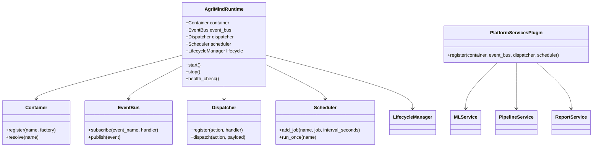

# Class Diagram

```mermaid
classDiagram
    class AgriMindRuntime {
        +Container container
        +EventBus event_bus
        +Dispatcher dispatcher
        +Scheduler scheduler
        +LifecycleManager lifecycle
        +start()
        +stop()
        +health_check()
    }

    class Container {
        +register(name, factory)
        +resolve(name)
    }

    class EventBus {
        +subscribe(event_name, handler)
        +publish(event)
    }

    class Dispatcher {
        +register(action, handler)
        +dispatch(action, payload)
    }

    class Scheduler {
        +add_job(name, job, interval_seconds)
        +run_once(name)
    }

    class PlatformServicesPlugin {
        +register(container, event_bus, dispatcher, scheduler)
    }

    class MLService {}
    class PipelineService {}
    class ReportService {}

    AgriMindRuntime --> Container
    AgriMindRuntime --> EventBus
    AgriMindRuntime --> Dispatcher
    AgriMindRuntime --> Scheduler
    AgriMindRuntime --> LifecycleManager
    PlatformServicesPlugin --> MLService
    PlatformServicesPlugin --> PipelineService
    PlatformServicesPlugin --> ReportService
```