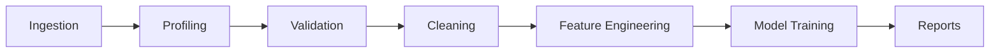

# Pipeline Diagram

This reflects the data-processing pipeline modules currently present under [core/app/data](../../app/data) and the ML/reporting subsystems under [core/app/ml](../../app/ml) and [core/app/services](../../app/services).
