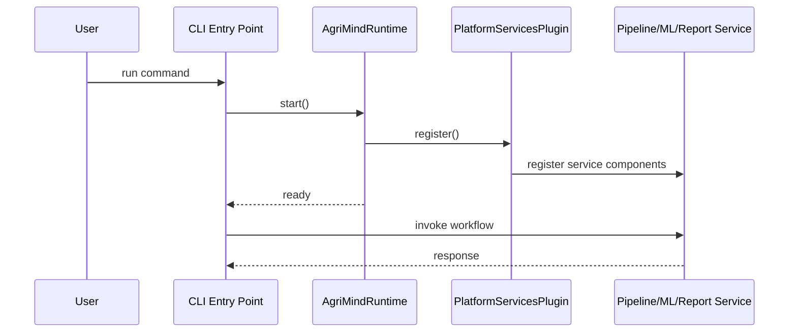

# Sequence Diagram

```mermaid
sequenceDiagram
    participant User
    participant CLI as CLI Entry Point
    participant Runtime as AgriMindRuntime
    participant Plugin as PlatformServicesPlugin
    participant Service as Pipeline/ML/Report Service

    User->>CLI: run command
    CLI->>Runtime: start()
    Runtime->>Plugin: register()
    Plugin->>Service: register service components
    Runtime-->>CLI: ready
    CLI->>Service: invoke workflow
    Service-->>CLI: response
```